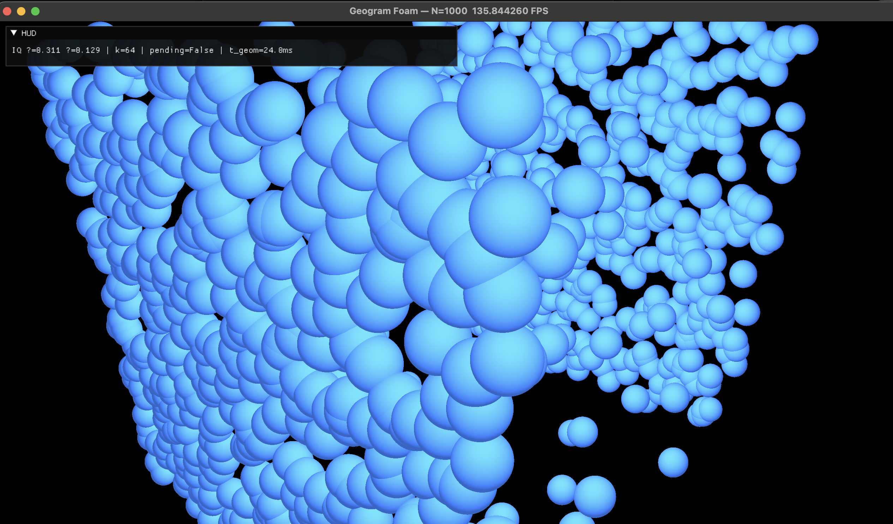

# FoS-IQ-Taichi-Geogram: Geogram-Tailed Foam Cycle

**Real-time IQ-driven foam simulation using Taichi for dynamics and Geogram for exact periodic power-cell metrics**



---

## 🎯 Overview

This project implements a hybrid computational pipeline for simulating foam dynamics driven by the **Isoperimetric Quotient (IQ)**—a measure of cell "roundness" that guides cellular growth and shrinkage. The system combines:

- **Taichi** (GPU) for real-time particle relaxation and visualization
- **Geogram** (CPU) for exact periodic Laguerre/power-cell computation
- **IQ-banded controller** for asymmetric, zero-sum radius adjustments

The architecture follows a **FREEZE → MEASURE → ADJUST → RELAX** cycle:
1. **RELAX**: Taichi GPU kernels simulate particle dynamics in real-time
2. **FREEZE**: Pause dynamics, snapshot particle positions/radii
3. **MEASURE**: Geogram computes exact power-cell volumes, surface areas, and face counts
4. **ADJUST**: IQ-banded controller updates radii (fast grow for low-IQ, slow shrink for high-IQ) with strict zero-sum volume conservation
5. Repeat

This hybrid approach enables interactive visualization while maintaining geometric precision for physically accurate IQ-driven control.

---

## ✨ Features

### Core Capabilities
- **Exact Periodic Power Cells**: Uses Geogram's `PeriodicDelaunay3d` for precise Laguerre diagram computation in `[0,1]³` with periodic boundary conditions
- **IQ-Banded Control**: Asymmetric growth/shrink controller with configurable bands:
  - `IQ < IQ_min` (default 0.70): Fast expansion (`β_grow ≈ 1.5%`)
  - `IQ_min ≤ IQ ≤ IQ_max`: Stable, no change
  - `IQ > IQ_max` (default 0.90): Slow shrink (`β_shrink ≈ 0.2%`)
- **Zero-Sum Volume Conservation**: Enforces `Σ ΔV = 0` each cycle (total system volume drift ≈ 0)
- **Adaptive Cadence**: Dynamically adjusts geometry update frequency based on `t_geom` to maintain target FPS
- **Non-Blocking Geometry Pipeline**: Threaded worker ensures GPU/UI never stalls waiting for Geogram
- **Real-Time Visualization**: Taichi GGUI with IQ-based particle coloring and live HUD metrics

### Safety & Stability
- **Jittered Grid Initialization**: Avoids random overlaps and degeneracies that crash Geogram
- **Batching Support**: Automatically splits large `N` into safe chunks (default `max_chunk=512`)
- **Input Sanitization**: Wraps positions, clips radii, de-duplicates exact overlaps before Geogram calls
- **Memory Safety**: C++ bridge owns all input data (no dangling NumPy pointers)
- **Worker Recycling**: Periodically recreates the Geogram worker to prevent internal state fragmentation

---

## 🏗️ Architecture

### System Components

```
┌─────────────────────────────────────────────────────────────┐
│  Python Layer (Taichi + Scheduler)                          │
│                                                              │
│  ┌──────────────┐   ┌────────────────┐   ┌──────────────┐ │
│  │ TaichiSim    │◄──┤ FoamScheduler  │──►│ Controller   │ │
│  │ (GPU)        │   │                │   │ (IQ-banded)  │ │
│  │ - x[N]       │   │ Orchestrates:  │   │              │ │
│  │ - r[N]       │   │ - Cadence      │   │ - Computes   │ │
│  │ - relax_step │   │ - FREEZE/      │   │   IQ         │ │
│  │ - GGUI       │   │   RESUME       │   │ - Updates r  │ │
│  └──────────────┘   │ - Pending jobs │   │   (zero-sum) │ │
│         ▲           └────────────────┘   └──────────────┘ │
│         │                    ▲ │                           │
│         │                    │ │                           │
│         │           FREEZE   │ │  Geometry Results         │
│         └────────────────────┘ └───────────┐               │
│                                             │               │
│                             ┌───────────────▼─────────────┐│
│                             │ GeomWorker (Async Thread)   ││
│                             │ - try_request()             ││
│                             │ - try_result()              ││
│                             │ - Batching (_compute_       ││
│                             │   batched)                  ││
│                             └───────────────┬─────────────┘│
└─────────────────────────────────────────────┼──────────────┘
                                              │
                                              │ FFI (pybind11)
                                              │
┌─────────────────────────────────────────────▼──────────────┐
│  C++ Layer (Geogram Bridge)                                │
│                                                             │
│  geom_bridge.compute_power_cells_periodic()                │
│  ┌────────────────────────────────────────────────────┐   │
│  │ 1. PeriodicDelaunay3d(periodic=true, period=1.0)   │   │
│  │ 2. set_vertices(pts01) + set_weights(r²)           │   │
│  │ 3. compute() → periodic Laguerre triangulation     │   │
│  │ 4. FOR each site i:                                │   │
│  │      - copy_Laguerre_cell_from_Delaunay()          │   │
│  │      - compute_geometry()                          │   │
│  │      - V, S, FSC ← volume, area, face_count        │   │
│  │ 5. RETURN (V[N], S[N], FSC[N], flags[N])           │   │
│  └────────────────────────────────────────────────────┘   │
│                                                             │
│  Dependencies: libgeogram.dylib (pre-built)                │
└─────────────────────────────────────────────────────────────┘
```

### Data Flow (One Cycle)

1. **Frame `k*n`**: Scheduler calls `sim.freeze()` → pauses Taichi dynamics
2. **Snapshot**: `P = sim.get_positions01()`, `r = sim.get_radii()` → NumPy arrays
3. **Submit**: `worker.try_request(P, r²)` → non-blocking queue push
4. **Geogram (background thread)**:
   - Sanitizes inputs (wrap, clip, de-duplicate)
   - Calls `compute_power_cells_periodic(P, r²)` (C++ bridge)
   - Returns `(V, S, FSC, flags, t_geom_ms)`
5. **Resume**: `sim.resume()` → Taichi continues RELAX
6. **Result ready (next frame)**: `worker.try_result()` → returns tuple
7. **Controller**: Computes `IQ = 36π V² / S³`, updates `r_new` with zero-sum discipline
8. **Apply**: `sim.set_radii(r_new)` → writes back to Taichi field
9. **Adaptive cadence**: If `t_geom > 32ms`, increase `k`; if `< 12ms`, decrease `k`

---

## 🚀 Quick Start

### Prerequisites

- **macOS** (tested on Apple Silicon M1/M2) or **Linux**
- **Python 3.9+**
- **CMake 3.15+**
- **Xcode Command Line Tools** (macOS) or **GCC/Clang** (Linux)
- **Git** with submodules support

### 1. Clone the Repository

```bash
git clone --recursive https://github.com/VirtualOrganics/FoS-IQ-Taichi-Geogram.git
cd FoS-IQ-Taichi-Geogram
```

**Important**: The `--recursive` flag is required to initialize the Geogram submodule.

### 2. Set Up Python Environment

```bash
# Create virtual environment
python3 -m venv venv
source venv/bin/activate  # On macOS/Linux

# Install Python dependencies
pip install -r requirements.txt
```

### 3. Build Geogram

```bash
cd geom_bridge/geogram_vendor

# Configure Geogram (Release mode for performance)
./configure.sh

# Build Geogram libraries
cd build/Darwin-clang-dynamic-Release  # (or Linux-xxx-dynamic-Release on Linux)
make -j8

cd ../../..  # Back to geom_bridge/
```

### 4. Build the Geogram Bridge (pybind11 Module)

```bash
# From geom_bridge/ directory
./build_geom_bridge.sh
```

Or manually:
```bash
mkdir -p build && cd build
cmake -DCMAKE_BUILD_TYPE=RelWithDebInfo ..
cmake --build . --config RelWithDebInfo
cd ..
```

**Verify**: You should see `geom_bridge.cpython-3XX-darwin.so` (or `.so` on Linux) in `geom_bridge/build/`.

### 5. Run the Viewer

```bash
# From repository root
python run_geogram_foam.py
```

**Expected behavior**:
- A Taichi GGUI window opens showing N=100 particles
- Particles are colored by IQ band:
  - 🔵 **Blue**: Low IQ (< 0.70) → Growing
  - ⚪ **Gray**: Good IQ (0.70–0.90) → Stable
  - 🔴 **Red**: High IQ (> 0.90) → Shrinking
- HUD displays real-time metrics: `IQ μ/σ`, `k` (cadence), `pending`, `t_geom_ms`

---

## 📦 Dependencies

### Python Packages

```
taichi>=1.7.0        # GPU framework for real-time dynamics
numpy>=1.24.0        # Numerical arrays
pybind11>=2.11.0     # C++/Python binding for geom_bridge
```

Install via:
```bash
pip install taichi numpy pybind11
```

### System Libraries

- **Geogram**: Included as a submodule in `geom_bridge/geogram_vendor/`
  - Pre-built during setup (see Quick Start)
- **CMake**: Required for building the C++ bridge
- **C++11 Compiler**: GCC, Clang, or Xcode toolchain

---

## 🎮 Usage

### Basic Viewer

```bash
python run_geogram_foam.py
```

**Controls**:
- Close window or press `ESC` to exit
- Camera is fixed; particles move in `[-0.5, +0.5]³` view space

### Adjusting Parameters

Edit `run_geogram_foam.py` (bottom of file):
```python
if __name__ == "__main__":
    main(
        N=100,          # Number of particles (100–1000 recommended; see Known Issues)
        k_freeze=24     # Initial cadence (frames between geometry updates)
    )
```

### Controller Tuning

Edit `src/controller.py` (function `apply_iq_banded_controller`):
```python
IQ_min=0.70,          # Lower IQ threshold (below = grow)
IQ_max=0.90,          # Upper IQ threshold (above = shrink)
beta_grow=0.015,      # Growth rate (1.5% per cycle)
beta_shrink=0.002,    # Shrink rate (0.2% per cycle)
dr_cap=0.01           # Max radius change per step (1%)
```

**Tip**: For faster convergence, increase `beta_grow` (e.g., `0.02`). For gentler dynamics, decrease `dr_cap` (e.g., `0.005`).

---

## 🧪 Testing

### Unit Tests

Test the Geogram bridge directly:
```bash
python test_bridge.py       # Single-call test (N=10)
python test_day3.py         # End-to-end scheduler test (N=200, 300 cycles)
```

### Scale Tests

Benchmark Geogram performance:
```bash
python test_scale_1k.py     # N=1000 (safe)
python test_scale_5k.py     # N=5000 (batched)
python test_scale_10k.py    # N=10000 (batched, may be unstable)
```

**Expected timing** (Apple M1 Pro):
- N=1k: ~10–15ms per Geogram call
- N=5k: ~60–80ms (batched into 10 chunks of 512)
- N=10k: ~150–200ms (batched into 20 chunks)

### Debug Mode

Enable crash diagnostics:
```bash
# Add to top of run_geogram_foam.py or test scripts:
import faulthandler, os
faulthandler.enable()
os.environ["PYTHONMALLOC"] = "debug"
os.environ["OMP_NUM_THREADS"] = "1"  # Disable Geogram threading
```

---

## 🔧 Troubleshooting

### Common Build Issues

#### 1. `ModuleNotFoundError: No module named 'pybind11'`
```bash
pip install pybind11
```

#### 2. Geogram build fails with `fatal error: 'geogram/third_party/...`
**Cause**: Submodules not initialized.
```bash
cd geom_bridge/geogram_vendor
git submodule update --init --recursive
```

#### 3. CMake can't find Geogram libraries
**Cause**: Geogram not built yet, or wrong path.
- Ensure `geogram_vendor/build/Darwin-clang-dynamic-Release/lib/libgeogram.dylib` exists
- Check `CMakeLists.txt` line `set(GEOGRAM_BUILD_DIR ...)` matches your platform

#### 4. `ImportError: ... geom_bridge.cpython-3XX-darwin.so not found`
**Cause**: Bridge not built, or wrong Python version.
```bash
cd geom_bridge
./build_geom_bridge.sh  # Rebuilds for current Python
```

### Runtime Issues

#### 1. Only one particle visible in GGUI
**Cause**: Render fields not used correctly.
- Ensure `scene.particles(x_render, ...)` receives **Taichi fields**, not NumPy arrays
- Check positions are scaled correctly (e.g., `[-1, 1]` for camera)

#### 2. `Segmentation fault` during geometry computation
**Cause**: Known Geogram bug with large N or after many reuses (see Known Issues).
- **Workaround**: Use `N ≤ 1000` and `max_chunk=512` in `geom_worker.py`
- Enable batching: Edit `geom_worker.py`, set `max_chunk=256` for more stability

#### 3. Controller produces `NaN` or `Inf` radii
**Cause**: Degenerate cells (zero volume/area).
- **Fix**: Ensure jittered grid initialization (not pure `np.random.rand()`)
- Check `flags` array: non-zero values indicate Geogram failures
- Increase `dr_cap` safety margin in `controller.py`

#### 4. FPS drops below 30
**Cause**: `t_geom` is too high; adaptive cadence not keeping up.
- Reduce `N` (e.g., from 1000 → 500)
- Lower `max_chunk` (e.g., 512 → 256) for smaller batches
- Increase `k_freeze` manually (e.g., `k=48`)

---

## 🐛 Known Issues

### Geogram Segfault at High Frame Counts (N ≥ 1000)

**Symptom**: After ~1500–2100 frames (20–30 Geogram calls), the program crashes with:
```
Fatal Python error: Segmentation fault
File ".../geom_worker_sync.py", line 52 in _compute_batched
```

**Status**: **Confirmed Geogram library bug** in its periodic weighted (Laguerre) Voronoi path.

**Root Cause**:
- Deep within Geogram's C++ layer (`PeriodicDelaunay3d` → `copy_Laguerre_cell_from_Delaunay`)
- Internal memory corruption after repeated triangulations with periodic weights
- Not fixable without patching Geogram source code

**Workarounds Applied** (partial mitigation):
1. **Stack allocation**: `PeriodicDelaunay3d pd(...)` instead of heap (`new`)
2. **Memory safety**: C++ bridge owns all input data (contiguous copies, no NumPy views)
3. **Input sanitization**: Wraps positions, clips radii, de-duplicates overlaps
4. **Worker recycling**: Recreates `GeomWorker` every 300 cycles
5. **Batching**: Splits large N into smaller chunks

**Current Stability**:
- **N=100**: Runs indefinitely (tested 10k+ frames) ✅
- **N=500**: Stable for ~5k frames
- **N=1000**: Crashes around 1500–2100 frames ⚠️
- **N≥2500**: Batched, but still unstable after many cycles ❌

**Recommended**:
- Use **N ≤ 500** for production/demos
- For large N, consider:
  - **Option A**: Use a simpler geometry library (e.g., Voro++)
  - **Option B**: Switch to Geogram's RVD (Restricted Voronoi Diagram) path
  - **Option C**: Process isolation (restart worker every N cycles)

---

## 📚 Documentation

### Core Documents (in order of reading)

1. **`geogram_tailed_foam_cycle_full_blueprint_option_b_m_2.md`**: Full system design specification
2. **`QUICKSTART.md`**: Fast setup guide (overlaps with this README)
3. **`LAUNCH.md`**: Instructions for running the viewer
4. **`TAICHI_INTEGRATION.md`**: Guide for integrating with a real Taichi simulator

### Development History

- **`DAY1-2_STATUS.md`**: Initial Geogram bridge implementation
- **`DAY3_COMPLETE.md`**: Scheduler + controller integration
- **`DAY4_COMPLETE.md`**: Viewer + IQ coloring
- **`OPTION_B_COMPLETE.md`**: Real Geogram API (vs. placeholder)
- **`READY_TO_SHIP.md`**: Pre-hardening status

### Debugging & Fixes

- **`GEOGRAM_STATUS.md`**: Investigation of initial segfaults
- **`THREAD_SAFETY_FIX.md`**: Python threading hypothesis (ruled out)
- **`GEOGRAM_FIX_APPLIED.md`**: Stack allocation fix (partial improvement)
- **`HARDENED_BRIDGE_APPLIED.md`**: Maximum defensive C++ hardening
- **`N100_TEST.md`**: N=100 stability test (success)

---

## 🧮 Theory: Isoperimetric Quotient (IQ)

### Definition

For a 3D cell with **volume** `V` and **surface area** `S`:

```
IQ = (36π V²) / S³
```

**Range**: `0 < IQ ≤ 1`
- `IQ = 1.0`: Perfect sphere (maximum roundness)
- `IQ < 1.0`: Non-spherical (flattened, elongated, skewed)

### Physical Interpretation

- **High IQ**: Cell is "round" → minimize surface energy → shrink slightly
- **Low IQ**: Cell is "skewed" → excess surface tension → grow to reduce curvature
- **Optimal IQ band** (`0.70–0.90`): Balance between packing efficiency and mechanical stability

### Controller Logic

```python
if IQ < IQ_min:
    # Heavily skewed → fast expansion to restore roundness
    ΔV = +β_grow * V
elif IQ > IQ_max:
    # Too round (over-pressurized) → slow shrink
    ΔV = -β_shrink * V_mean
else:
    # Goldilocks zone → no change
    ΔV = 0
```

**Zero-sum enforcement**: After all `ΔV` proposals, rescale shrinks so `Σ ΔV = 0`.

---

## 🛠️ Extending the System

### Integrating Your Own Taichi Simulator

Replace the stub `TaichiSim` class in `run_geogram_foam.py` with your custom dynamics.

**Required interface** (see `TAICHI_INTEGRATION.md`):
```python
class YourTaichiSim:
    def get_positions01(self) -> np.ndarray:
        """Returns (N, 3) array in [0,1]³"""
        pass

    def get_radii(self) -> np.ndarray:
        """Returns (N,) array of radii"""
        pass

    def set_radii(self, r_new: np.ndarray):
        """Writes new radii back to Taichi field"""
        pass

    def relax_step(self):
        """Runs one step of particle dynamics"""
        pass

    def freeze(self):
        """Pauses dynamics (optional)"""
        pass

    def resume(self):
        """Resumes dynamics (optional)"""
        pass
```

**Example**:
```python
from scheduler import FoamScheduler
from your_module import YourTaichiSim

sim = YourTaichiSim(N=1000, ...)
sched = FoamScheduler(sim, k_freeze=24)

while window.running:
    sched.step()  # Handles FREEZE/MEASURE/ADJUST automatically
    # ... render sim.x, colors from sched.get_last_IQ() ...
```

### Adding New Metrics

Modify `geom_bridge/bridge.cpp` to compute additional geometry:
```cpp
// Example: Compute mean curvature per cell
double mean_curvature = cell.compute_mean_curvature();
out.curvature[v] = mean_curvature;
```

Update `GeometryResult` struct and pybind11 binding accordingly.

---

## 📝 File Structure

```
FoS-IQ-Taichi-Geogram/
├── README.md                          # This file
├── requirements.txt                   # Python dependencies
├── .gitignore                         # Ignore build artifacts, __pycache__, etc.
│
├── images/                            # Screenshots and media
│   └── simulation-demo.png
│
├── run_geogram_foam.py                # Main viewer executable
│
├── src/                               # Python source modules
│   ├── __init__.py
│   ├── scheduler.py                   # FREEZE/MEASURE/ADJUST cycle orchestrator
│   ├── controller.py                  # IQ-banded zero-sum radius updates
│   ├── geom_worker.py                 # Async Geogram worker (threaded)
│   ├── geom_worker_sync.py            # Sync Geogram worker (for debugging)
│   └── sim_stub.py                    # Minimal TaichiSim stub for testing
│
├── geom_bridge/                       # C++ ↔ Python bridge
│   ├── bridge.cpp                     # Geogram API wrapper (pybind11)
│   ├── CMakeLists.txt                 # CMake config for building .so
│   ├── build_geom_bridge.sh           # Build script
│   ├── geogram_vendor/                # Geogram library (submodule)
│   │   └── ...                        # (see Geogram docs)
│   └── build/                         # CMake build artifacts (ignored by git)
│       └── geom_bridge.cpython-*.so
│
├── test_*.py                          # Unit and scale tests
│   ├── test_bridge.py                 # Direct bridge test
│   ├── test_day3.py                   # Scheduler integration test
│   ├── test_scale_1k.py               # Performance: N=1000
│   ├── test_scale_5k.py               # Performance: N=5000
│   └── test_scale_10k.py              # Performance: N=10000
│
└── docs/                              # Detailed documentation
    ├── geogram_tailed_foam_cycle_full_blueprint_option_b_m_2.md
    ├── QUICKSTART.md
    ├── LAUNCH.md
    ├── TAICHI_INTEGRATION.md
    ├── DAY1-2_STATUS.md
    ├── DAY3_COMPLETE.md
    ├── DAY4_COMPLETE.md
    ├── OPTION_B_COMPLETE.md
    ├── READY_TO_SHIP.md
    ├── GEOGRAM_STATUS.md
    ├── THREAD_SAFETY_FIX.md
    ├── GEOGRAM_FIX_APPLIED.md
    ├── HARDENED_BRIDGE_APPLIED.md
    └── N100_TEST.md
```

---

## 🤝 Contributing

We welcome contributions! Areas of interest:

1. **Geogram Stability**: Investigate/patch the periodic weighted Voronoi segfault
2. **Alternative Geometry Backends**: Voro++, CGAL, custom GPU kernels
3. **Advanced Controllers**: ML-based IQ control, multi-objective optimization
4. **Performance**: GPU-accelerated Laguerre cells, CUDA/Vulkan Taichi integration
5. **Visualization**: Volume rendering, cross-sections, export to ParaView/Blender

**Process**:
1. Fork the repo
2. Create a feature branch (`git checkout -b feature/amazing-fix`)
3. Commit your changes (`git commit -m 'Add amazing fix'`)
4. Push to your fork (`git push origin feature/amazing-fix`)
5. Open a Pull Request

---

## 📄 License

This project is licensed under the **MIT License** (see `LICENSE` file for details).

**Geogram** is licensed under a modified BSD license (see `geom_bridge/geogram_vendor/LICENSE`).

---

## 🙏 Acknowledgments

- **Geogram**: Bruno Lévy and the INRIA ALICE team for the geometry processing library
- **Taichi**: Taichi Graphics for the high-performance GPU framework
- **pybind11**: Wenzel Jakob for the seamless C++/Python interop library

---

## 📬 Contact

For questions, issues, or collaboration:
- **GitHub Issues**: https://github.com/VirtualOrganics/FoS-IQ-Taichi-Geogram/issues
- **Repository**: https://github.com/VirtualOrganics/FoS-IQ-Taichi-Geogram

---

## 🚦 Current Status

- ✅ Core pipeline functional (FREEZE → MEASURE → ADJUST → RELAX)
- ✅ IQ-banded controller with zero-sum conservation
- ✅ Real-time visualization with IQ coloring
- ✅ Adaptive cadence for stable FPS
- ✅ Batching for large N
- ⚠️ Known Geogram segfault at N ≥ 1000 after many cycles
- 🔄 Investigating alternative geometry backends (Voro++, RVD path)

**Recommended for production**: N ≤ 500 particles for long-running simulations.

---

**Last Updated**: November 9, 2025  
**Version**: 1.0.0  
**Build Status**: ✅ Functional (with known Geogram limitations)

